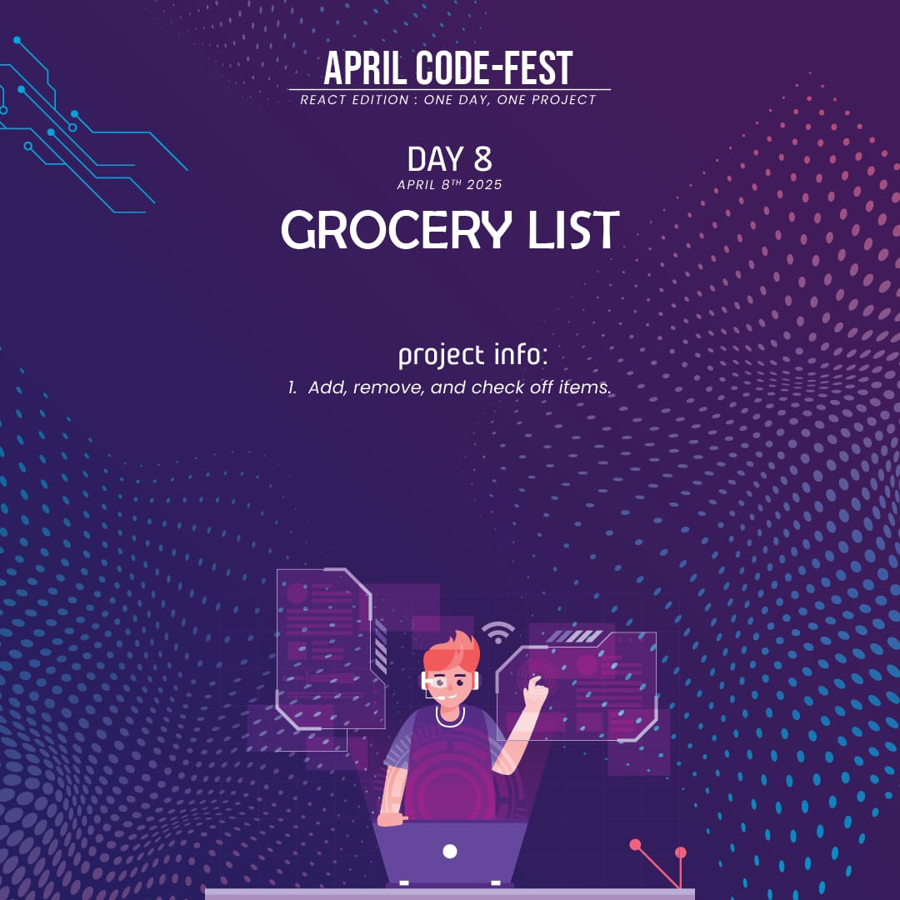
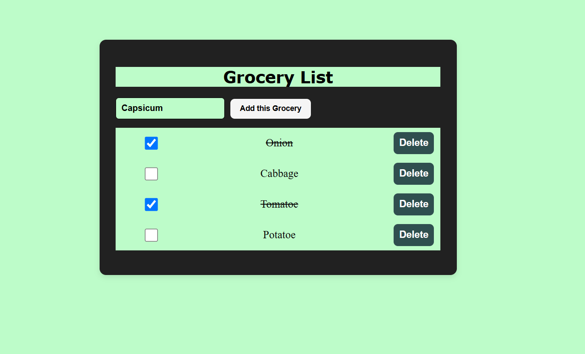

# 🛒 Grocery List App

A simple **React** application that allows users to manage their grocery list. It includes features for adding, deleting, and marking items as bought.

## 📌 Features
- ✅ **Add Items**: Users can add new grocery items to the list.
- ✅ **Delete Items**: Users can delete items from the list.
- ✅ **Mark as Bought**: Items can be checked off to indicate they are bought.
- ✅ **Responsive Design**: Works across different screen sizes and devices.
- ✅ **Minimalist UI**: Simple and clean design for ease of use.

## 🛠️ Technologies Used
- ⚛️ **React** (useState for state management and handling interactions)
- 🎨 **CSS** (for styling the user interface)
- 📄 **HTML** (for structuring content)

## 🚀 Live Demo
To see it in action, clone the repository and follow the setup instructions below.

## 🚀 Getting Started

1. **Clone the repository:**

   ```bash
   git clone https://github.com/Eshhaa11/grocery-list
   
2. **Navigate to the project directory:**

   cd grocery-list

3. **Install dependencies:**

   npm install

4. **Start the development server:**

   npm start

5. **Open your browser and visit:**

   http://localhost:3000

 ## 🎨 Screenshots:
 

##🤝 Contributing
Want to improve this project? Fork the repository, create a feature branch, and open a pull request. All contributions are welcome! 🚀✨

🎉 Happy Coding!